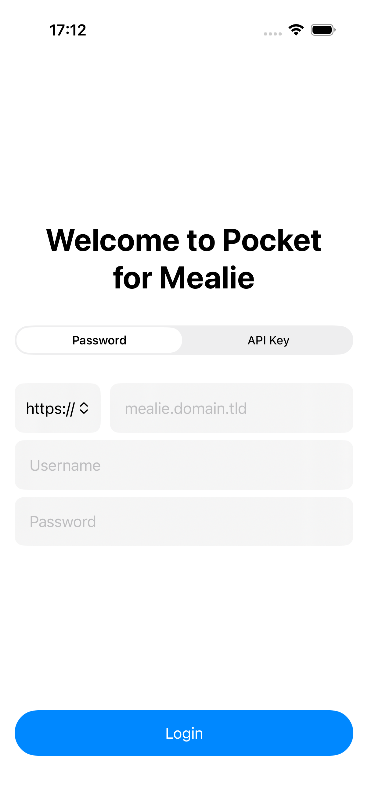
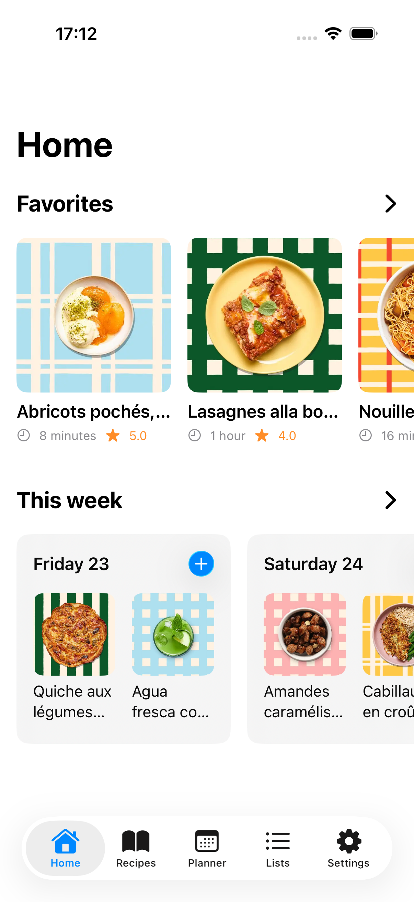
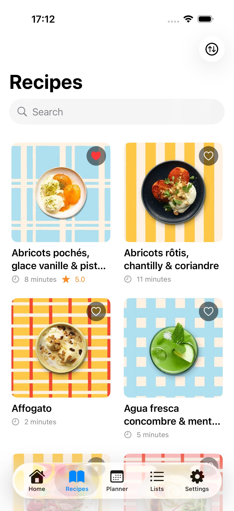
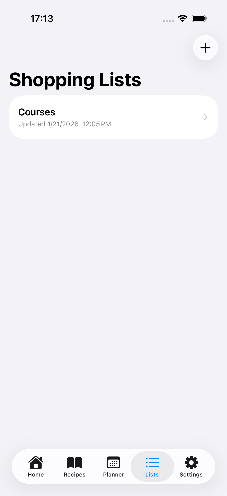
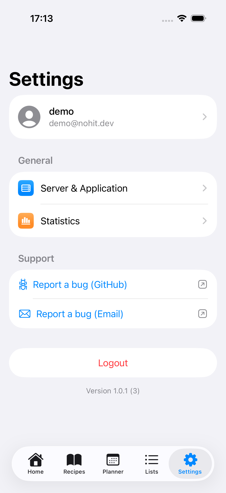

# MealiePocket

**MealiePocket** is an unofficial, native iOS client for the [Mealie](https://github.com/mealie-recipes/mealie) recipe manager.

It lets you browse recipes, manage meal plans, and keep shopping lists in sync with your Mealie server.

> [!IMPORTANT]
> **A working Mealie instance reachable from your device is required to use MealiePocket.**
>
> You can authenticate with an API key or user token, and credentials are stored securely in the iOS Keychain.

## Overview

| Login | Home | Recipes | Recipe Detail |
| :---: | :--: | :-----: | :-----------: |
|  |  |  |  |

| Planner | Lists | List Detail | Settings |
| :-----: | :---: | :---------: | :------: |
|  |  |  |  |

## Key Features

-   [x] **Secure Connection**: Connects to your Mealie server with API tokens or API keys stored in the Keychain.
-   [x] **Recipe Browser**: Search, filter, sort, and favorite recipes with ratings.
-   [x] **Meal Planning**: Add recipes to specific dates and meal types.
-   [x] **Shopping Lists**: Create lists, add items, and import items from meal plans.
-   [x] **Admin Tools**: View reports, logs, backups, and maintenance actions when available.
-   [x] **Localization**: English and French UI support.

## Roadmap

-   [ ] iPad-optimized layouts.
-   [ ] Widgets.
-   [ ] Additional languages.

## Technologies Used

-   **SwiftUI**: Declarative UI across the entire app.
-   **Swift Concurrency (`async/await`)**: Modern networking and state updates.
-   **Keychain Services**: Secure credential storage.

## Installation

### Build From Source

1. Clone the repository.
2. Open `MealiePocket.xcodeproj` in Xcode.
3. Set your signing team and bundle identifier.
4. Build and run on a simulator or device.

## Acknowledgements

Thanks to the [Mealie](https://github.com/mealie-recipes/mealie) community for building a great open-source recipe manager.

## License

This project is distributed under the MIT License. See the [LICENSE](./LICENSE.md) file for more details.
